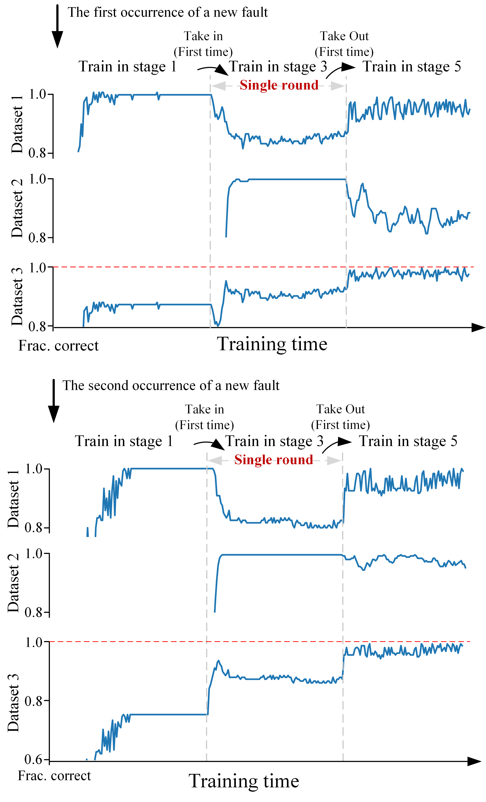

  <h1 align="center">Fault Diagnosis in Satellite System: A Federated Learning Approach with Communication Constraints</h1>

## 🖼️ Demo

 ## 📝 Abstract

Satellites operate in harsh space environments for extended periods, making fault diagnosis a critical strategy for extending their lifespan. The federated learning fault diagnosis method based on telemetry data is a novel approach in the field of satellite fault diagnosis. This method can both address the data privacy issues across different TT\&C centers and improve the poor fault diagnosis performance caused by the low quality of the training data set of a single TT\&C center. However, challenges arise in the deployment and application of federated learning methods due to **"Communication-limited"** and **"Extreme Heterogeneity"**  at some TT\&C centers. To solve such a problem, this paper proposes a streaming federated learning framework for satellite fault diagnosis-**FedSAT**, with efficient communication and privacy protection. Under this framework, the TT\&C center with communication constraints only needs to participate in a single round of federated learning for the system to obtain a well-performing and stable model. Simulations verify the effectiveness of the proposed framework.

## 🧱 Framework

##  🚩 Main Result

Dataset 1 represents the dataset containing all faults of the TT\&C centers without communication constraints, Dataset 2 represents the dataset of faults from the TT\&C center with communication constraints, and Dataset 3 represents the full dataset containing all faults of the TT\&C centers. 

During the model training in the TT\&C center with communication constraints, the proposed algorithm learns the internal knowledge very effectively and does not excessively forget the external fault knowledge, thanks to the benefits of dual-domain distillation learning. When the model training in TT\&C centers without communication constraints, after forgetting compensation, the model can keep the internal knowledge well while constantly learning the external knowledge. **Taking centralized training as the upper bound of the algorithm, the proposed algorithm achieves a performance that is close to the optimal performance**. Note that the training time is not the federated learning rounds. In fact, the TT&C center with communication constraints only performed **single round** of federated learning.

## ✨ Scalability
Most research on federated learning is conducted under ideal conditions. However, in real-world applications, satellites continuously generate new fault data. To ensure the scalability of the proposed method, we further validates the performance of the framework under streaming conditions.

Experimental results indicate that the algorithm's performance does not significantly degrade with the increase in the number of new fault types (assuming that the model parameter size does not constitute a performance bottleneck). This result provides theoretical and technical support for subsequent engineering deployments.

## 🔭 Algorithm Comparison

Comparison with mainstream satellite fault diagnosis methods and emerging fault diagnosis methods.

In fact, since the current mainstream fault diagnosis algorithm is only trained on its own fault data set, it is difficult for the model to effectively learn faults with scarce fault samples, and the model recognition ability is limited. Although it may meet the performance requirements, it cannot be applied in actual engineering because the model cannot recognize some faults at all, as shown on the left side of the figure below. The proposed method effectively integrates the fault knowledge of all TT&C centers, breaking through the limitations of a single TT&C center in terms of fault types and sample quantity, as shown on the right side of the figure below.

## 🎉 Ablation Study

## 💡 Experiments of Different Numbers of TT&C Centers with Different Degrees of Data Heterogeneity

## 🚀 Code
The code will be released after paper has been accepted.

